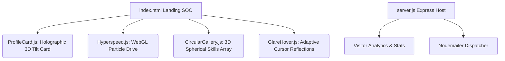

# 🛡️ SYSTEM CORE: CYBER SECURITY DIGITAL PORTFOLIO 🚀

<p align="center">
  
</p>

<p align="center">
  <a href="https://vibaie.github.io/website-portfolio/">
    
  </a>
</p>

<p align="center">
  
  
  
  
</p>

---

## ⚡ SYSTEM SUMMARY (TL;DR)

This repository houses a **premium, high-end dark cyber-security themed portfolio website**. It serves as a digital Security Operations Center (SOC) displaying academic credentials, dynamic skill matrices, interactive professional history, and advanced real-time frontend components. 

---

## 📸 SYSTEM INTERFACE SHOWCASE

<p align="center">
  
</p>

---

## 🛠️ ARCHITECTURAL MODULES & CORE ENGINES

This digital portfolio is engineered as a combination of responsive semantic layers and advanced graphics modules.



### 🛰️ Interactive Client Modules (Public Sandbox)
* **`ProfileCard.js` (Holographic 3D Card Engine):** An interactive matrix container that intercepts mouse vectors and applies responsive 3D tilt transformations with smooth CSS matrix rotations.
* **`Hyperspeed.js` (WebGL Particle Core):** Feeds dynamic vertex and fragment shaders to render a high-velocity particle field background simulating hyper-dimensional data flow.
* **`CircularGallery.js` (Three.js WebGL Ring):** Arranges projects/hobbies in a dynamic circular carousel using 3D camera geometry and responsive hover raycasting.
* **`GlareHover.js` (Adaptive Specular Highlights):** Generates active lighting reflections following cursor paths, mimicking high-tech hardware overlays.

### 🛡️ Backend Control Center (Express Server)
* **Express Host Router:** Serves static files and maps node dependencies (Three.js, etc.) dynamically.
* **Security Contact Proxy (`/api/contact`):** Validates incoming contact inquiries and prints payload structures directly to the system CLI.
* **Traffic Analyzer (`/api/visitor-count`):** Increments and persists the hit register using a local data matrix (`stats.json`).

---

## 📂 REPOSITORY ANATOMY

```bash
├── public/                 # Client-side Static Web Assets
│   ├── assets/             # Media assets, images & resumes
│   ├── CircularGallery.js  # Three.js circular carousel renderer
│   ├── GlareHover.js       # Dynamic lighting spotlight script
│   ├── Hyperspeed.js       # WebGL particle background engine
│   ├── ProfileCard.js      # Holographic 3D mouse-tilt script
│   ├── script.js           # Core landing animations & interaction layer
│   ├── styles.css          # Core CSS variables, typography & layout styling
│   ├── index.html          # SECURE MAIN LANDING (SOC Dashboard)
│   ├── skills.html         # Threat Level / Skill Matrix
│   ├── experience.html     # Active Missions / Career timeline
│   ├── education.html      # Certification & Training timeline
│   └── contact.html        # Secure Uplink / Form Gateway
├── server.js               # Express Server & REST Endpoint Gateway
├── auto-sync.js           # Auto-synchronization routine
├── stats.json              # Local persistent visitor ledger
├── package.json            # Node Manifest & dependencies
└── README.md               # System manual (You are here)
```

---

## 💻 SECURE SYSTEM COMPILE & SETUP

Follow these steps to deploy and run this repository in your local environment.

### 1. Clone the Node
Establish a secure connection and download the repository:
```bash
git clone https://github.com/Vibaie/website-portfolio.git
cd website-portfolio
```

### 2. Provision Dependencies
Install the required packages & engines:
```bash
npm install
```

### 3. Initialize Server
Boot up the main host thread:
```bash
# Production Mode
npm start

# Development Mode (with hot-reloading)
npm run dev
```

### 4. Open Communications
Point your browser to the local node:
```text
http://localhost:3000
```

---

## 📡 SECURE API DOCUMENTATION

### Visitor Hit Register
* **Endpoint:** `GET /api/visitor-count`
* **Query Params:** `inc=true` (optional, to register a new visitor)
* **Response Output:**
  ```json
  {
    "count": 42
  }
  ```

### Secure Uplink (Contact Form)
* **Endpoint:** `POST /api/contact`
* **Content-Type:** `application/json`
* **Payload Structure:**
  ```json
  {
    "name": "Guest Agent",
    "email": "agent@cyber.io",
    "message": "Establishing secure uplink..."
  }
  ```
* **Success Output:**
  ```json
  {
    "success": true,
    "message": "Message received! I'll get back to you soon."
  }
  ```

---

*Designed and engineered with cyber-resilience. Establish connection and explore freely.*

