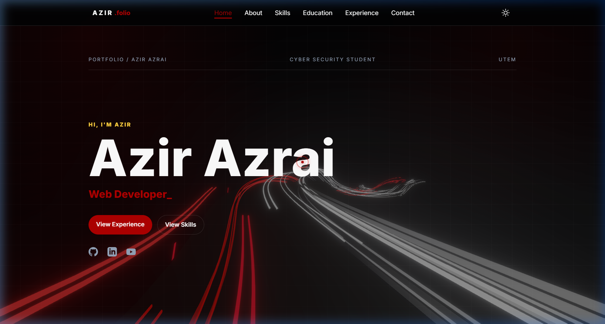

# Cyber Security Theme — Digital Portfolio 🛡️✨

Welcome to my personal digital portfolio! This is a premium, high-end dark cyber-security themed portfolio website showcasing my academic journey, tech stack, and interactive engineering projects.

<p align="center">
  <a href="https://meowzyyy.github.io/portfolio-website/">
    
  </a>
</p>

<p align="center">
  
  
  
</p>

---

## 📸 Website Showcase

<p align="center">
  
</p>

---

## 🚀 Key Features

* **Interactive Academic Timeline:** Responsive cyber-security timeline cards with custom spotlight glows and progress trackers.
* **Holographic 3D Tilt Cards:** Custom `ProfileCard.js` engine that tilts dynamically based on mouse movements and device orientation.
* **WebGL & Canvas Animations:** Custom digital particle background canvases, circular dynamic hobbies galleries, and liquid text pressure banners.
* **Visitor Analytics:** Integrated Node.js Express backend server tracking live site visitors.

---

## 🛠️ Tech Stack & Libraries

* **Frontend:** Core HTML5, Vanilla CSS3 (Custom Glassmorphism), Modern JavaScript (ES6+)
* **Graphics & Physics:** Three.js (Holographics & WebGL circular layouts)
* **Backend Development:** Node.js, Express.js
* **Automation & CI/CD:** GitHub Actions (custom deploy scripts targeting the `public/` directory)

---

## 💻 Local Development Setup

To spin up this portfolio on your local machine:

1. Clone this repository:
   ```bash
   git clone https://github.com/MeowZyyy/portfolio-website.git
   cd portfolio-website
   ```
2. Install all local dependencies:
   ```bash
   npm install
   ```
3. Start the Express server:
   ```bash
   npm start
   ```
4. Open your browser and navigate to:
   ```text
   http://localhost:3000
   ```

---

*Designed and engineered with passion. Feel free to explore and connect!*
